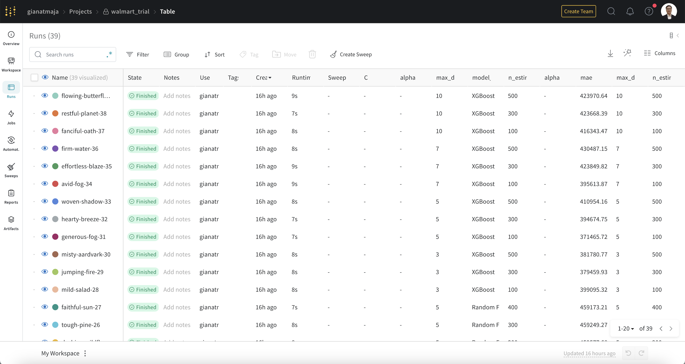

# WhizML-Walmart_Sales
This repository illustrates an application of the [WhizML codebase](https://github.com/Gianatmaja/WhizML) for an analysis of Walmart weekly sales.

## About the Dataset
The dataset used is the [Walmart dataset](https://www.kaggle.com/datasets/yasserh/walmart-dataset) obtained from Kaggle.

## Auto-EDA
Running the `eda` pipeline will launch the following Auto-EDA dashboard, allowing the users to observe the dataset.

## Data Preprocessing
Users can implement custom functions to preprocess the data. In our case, the preprocessing codes can be found in `Data_Preprocessing.ipynb`, inside the `notebooks` directory.

## ML Models Experimentation
The `model_experimentation` triggered the training of various Logistic Regression, Random Forest, and XGBoost models.

## Data Drift Analysis
As new data is obtained, drift detection can be performed using the `data_drift_analysis` pipeline. 

Note: To create a hypothetical example, some rows were sampled from the original dataset and were assumed to be the new data.
